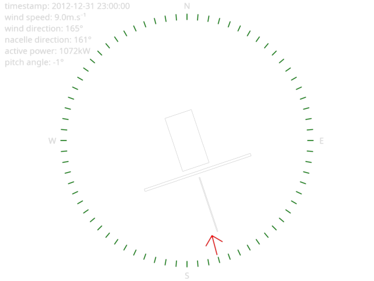

# scadaplayer

A thing for visualizing SCADA files.



## Installation

```shell
$ git clone https://github.com/jtremesay/scadaplayer.git
$ cd scadaplayer
$ direnv allow
$ pip install -r requirements.txt
```

## Usage

```
usage: main.py [-h] [--start START] [--end END] [--out OUT] scada_file

```

E.G:

```shell
$ python main.py --end 2013-01-02 data/scad
a_R80711.cs
```

This will generate an image per SCADA record. You can assemble them in a video with `ffmpeg`:

```shell
$ ffmpeg -framerate 1 -i out/scadaplayer_%09d.png scadaplayer_R80711.webm
```